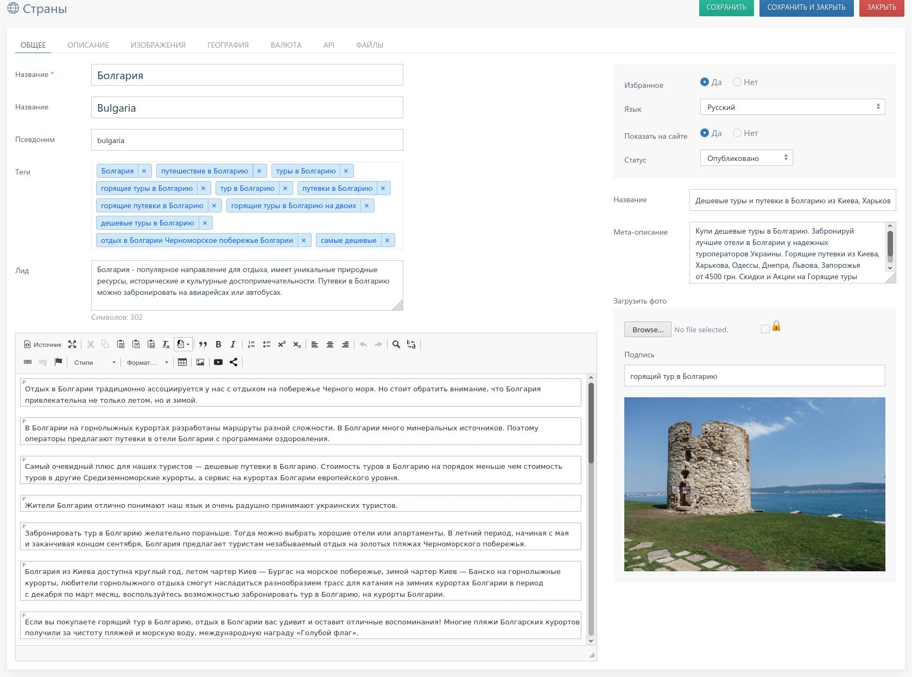

# JUTab template for SEBLOD CCK

Template for Form & Content Type Manager

## JUSebCCK library support

This template used JUSebCCK library for render tabs.

**JUSebCCK repo:** https://github.com/Joomla-Ukraine/JUSebCCK

## Demo

## ToDo
* Add override template (for folder `/html`)
* Add bootstrap templates
* etc...

## Sponsors

Thanks to [JetBrains](https://www.jetbrains.com/) for supporting the project through sponsoring some [All Products Packs](https://www.jetbrains.com/products.html) within their [Free Open Source License](https://www.jetbrains.com/buy/opensource/) program.